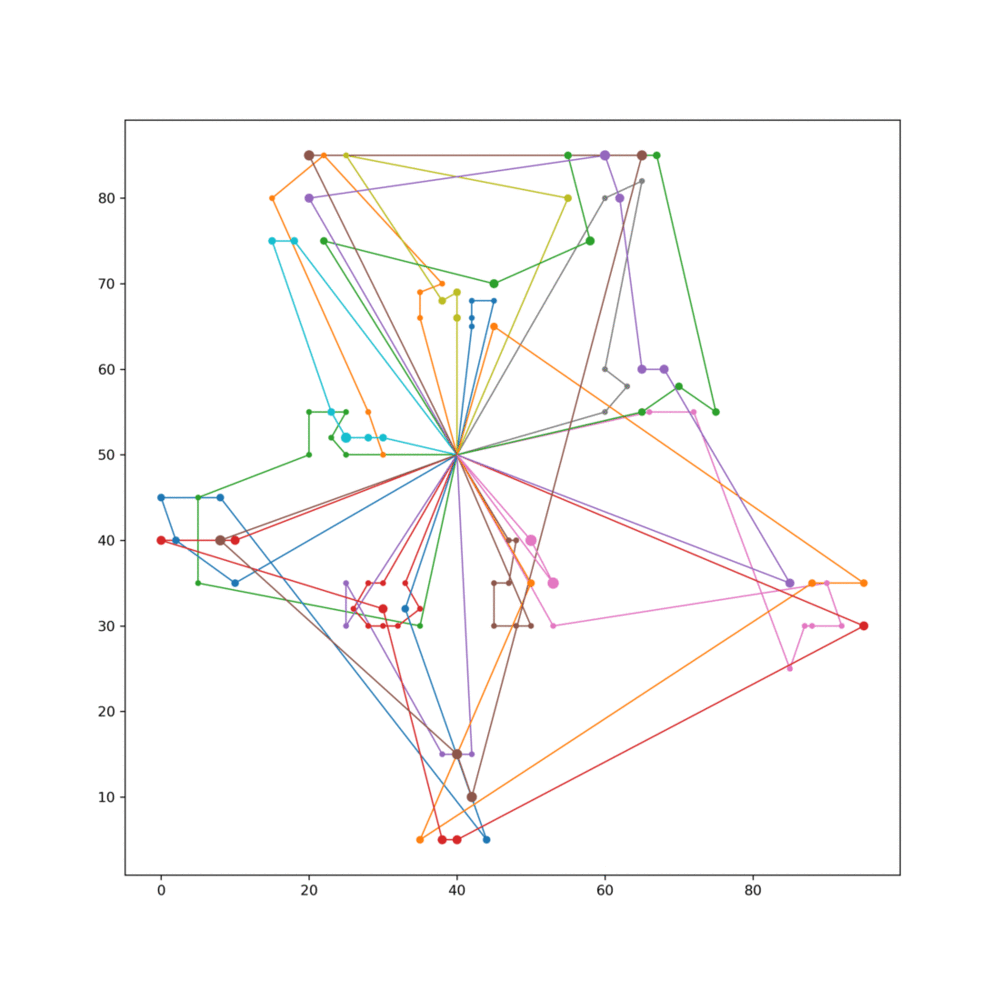

# Heuristic algorithms for the VRPTW

Iterated Local Search heuristic algorithm implementation for Vehicle Routing Problem with Time Windows (VRPTW).

## Basic usage

```sh
python -m vrptw ./instances/C108.txt
```

## Problem format

Below is a description of the format of the text file that defines each problem instance (assuming 100 customers).

```txt
<Instance name>
<empty line>
VEHICLE
NUMBER     CAPACITY
  K           Q
<empty line>
CUSTOMER
CUST NO.  XCOORD.   YCOORD.    DEMAND   READY TIME  DUE DATE   SERVICE TIME
 <empty line>
    0       x0        y1         q0         e0          l0            s0  
    1       x1        y2         q1         e1          l1            s1  
  ...     ...        ...        ...        ...         ...           ... 
  100     x100      y100       q100       e100        l100          s100
```

Format description original source: [link](https://www.sintef.no/projectweb/top/vrptw/documentation2)

## Solution visualizations

Below you can find animated example of 

### C108



### R148


### R168

