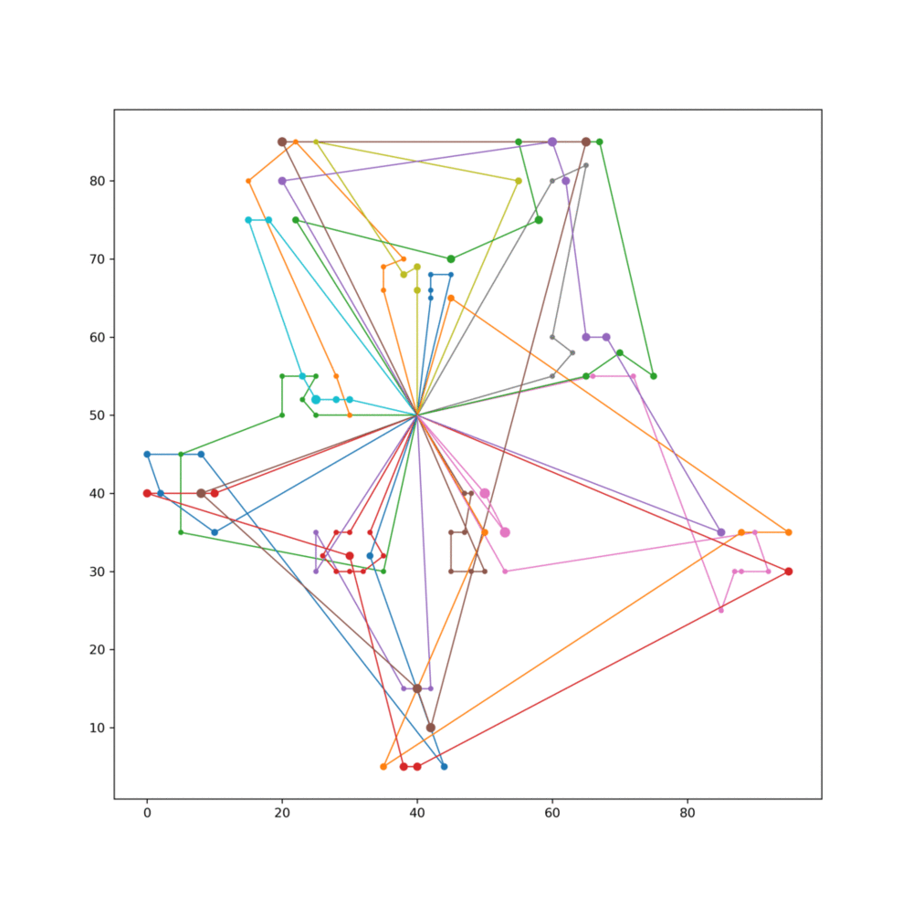
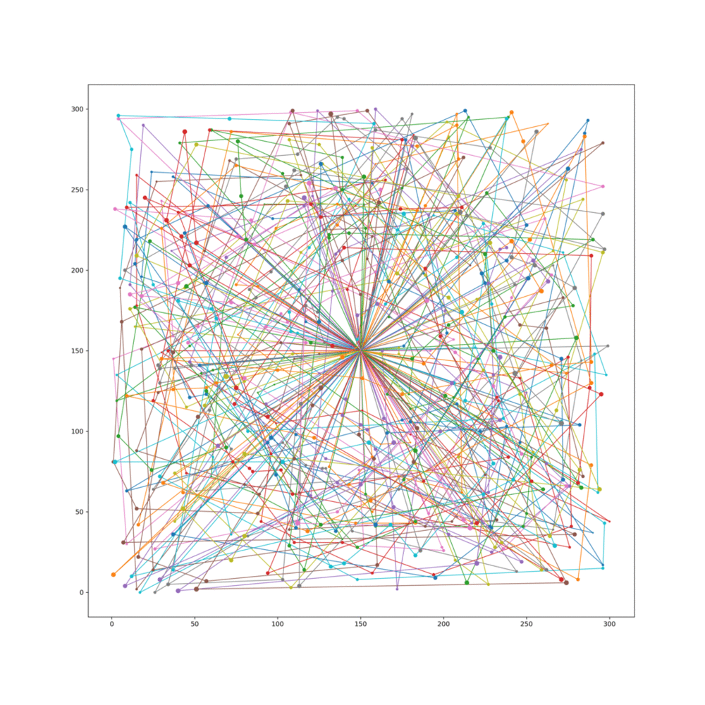

# Heuristic algorithms for the VRPTW

Implementations of the following metaheuristic algorithms Vehicle Routing Problem with Time Windows: 
 - Iterated local search
 - Guided local search

## Data

All input data should be in [Solomon benchmark format](https://www.sintef.no/projectweb/top/vrptw/solomon-benchmark/documentation/)

## Solutions

- C108
    
- R148
    
- R168
    